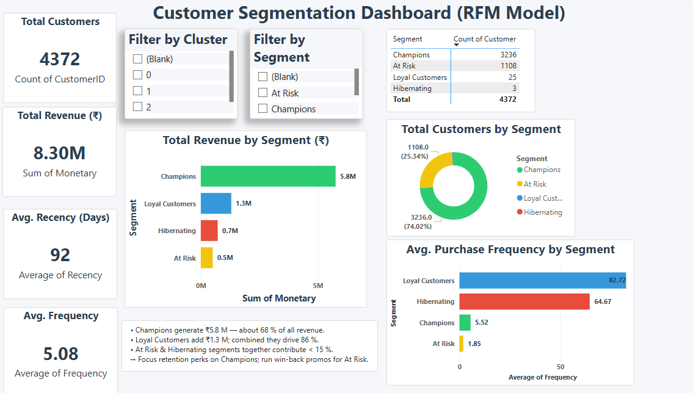
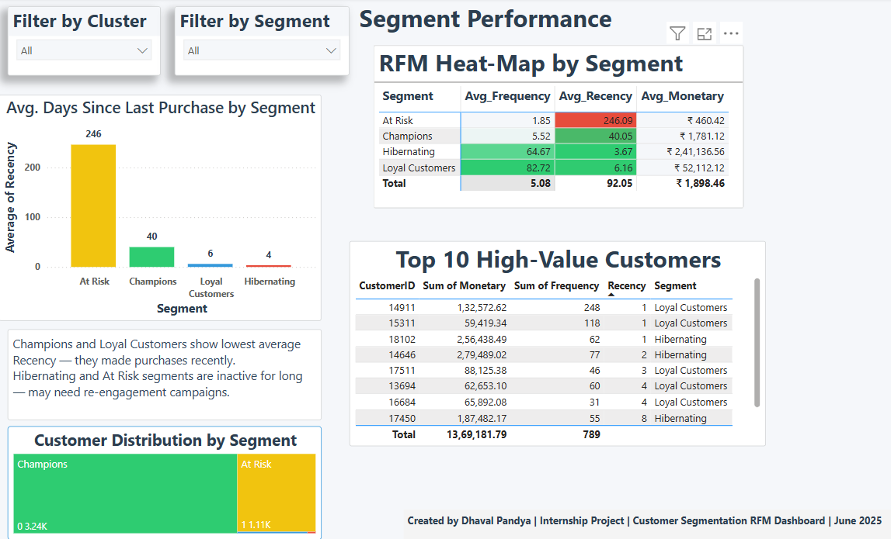

# Customer-Segmentation-RFM
RFM-based customer segmentation with Python &amp; Power BI

This project demonstrates customer segmentation using the **RFM (Recency, Frequency, Monetary)** model. The goal is to identify high-value customers, monitor engagement patterns, and guide marketing strategies using Power BI and Python.

## 📊 Dashboard Overview

The dashboard is divided into **two pages**:

### 🔹 Page 1: Customer Segmentation Overview (RFM Model)

- **KPIs**:  
  - Total Customers  
  - Total Revenue (₹)  
  - Avg. Recency (Days)  
  - Avg. Frequency

- **Filters**:  
  - Cluster  
  - Segment

- **Visuals**:  
  - 📦 Total Revenue by Segment  
  - 🧑‍🤝‍🧑 Total Customers by Segment (Donut Chart)  
  - 📈 Avg. Purchase Frequency by Segment  
  - 📋 Segment-Wise Customer Count (Table)

- **Insight Box**: Key observations about revenue contribution and retention strategies by segment.

---

### 🔹 Page 2: Segment Performance

- **Visuals**:  
  - 📊 Avg. Days Since Last Purchase by Segment  
  - 🧮 RFM Heatmap (Table with Conditional Formatting)  
  - 🏆 Top 10 High-Value Customers (by Monetary value)  
  - 🌍 Customer Distribution by Segment (Tree Map)

- **Insight Box**: Summary on recency-based behavior and re-engagement suggestions.

---

## ⚙️ Tools & Technologies

- 🐍 Python (Pandas, Scikit-learn for RFM Calculation & Clustering)
- 💾 Excel / CSV (Data Cleaning)
- 📊 Power BI (Visualization & Dashboard Design)

## 🔍 Project Workflow

### 1. Data Cleaning
- Removed null `CustomerID` and `Description` values.
- Converted data types (e.g., CustomerID → integer).
- Added `TotalPrice = Quantity × UnitPrice`.

### 2. RFM Feature Engineering
- **Recency**: Days since last purchase.
- **Frequency**: Total transactions.
- **Monetary**: Total spend.

### 3. RFM Scoring & Clustering
- RFM scores created using `qcut()` logic.
- Concatenated into `RFM_Score`.
- Applied **KMeans clustering** (k=4, via Elbow method).
- Assigned customer segments:  
  - 🎯 Champions  
  - 💸 At Risk  
  - 🤝 Loyal Customers  
  - 😴 Hibernating

### 4. Export & Dashboard Integration
- Exported final `rfm` table to Excel.
- Built Power BI dashboard with:
  - KPIs
  - Heatmaps
  - Tree maps
  - Cluster insights
  - Monthly trends
  - Customer segmentation visuals

---

## 📊 Dashboard Features

- **Dynamic Slicers**: Cluster & Segment filters.
- **KPIs**: Total Customers, Revenue, Avg Recency.
- **Segment Distribution**: Tree map, stacked bar, donut chart.
- **Top Segments**: By Frequency, Revenue, Count.
- **Time Trend**: Monthly behavior (if applicable).

---

## 💡 Key Insights

- **Champions** (Cluster 0) contribute ~60% of revenue.
- **At Risk** customers form a significant base with low purchase activity.
- **Hibernating** customers require reactivation strategies.
- **RFM Heatmap** shows strong contrast between segment behaviors.
- Business teams can now design targeted campaigns per segment.

---

## 👤 Author

This project was created by **Dhaval Pandya** as part of a Data Analytics Internship in June 2025.    
- Email: dhavalpandya8798@gmail.com

---

## 🗂 Data Source

The dataset used for this project is the **Online Retail Dataset** from the UCI Machine Learning Repository.  
It contains real-world transactional data from a UK-based online retailer between December 2010 and December 2011.

- Source: [UCI Online Retail Dataset](https://archive.ics.uci.edu/ml/datasets/online+retail)  
- License: For research and educational use only.

---

